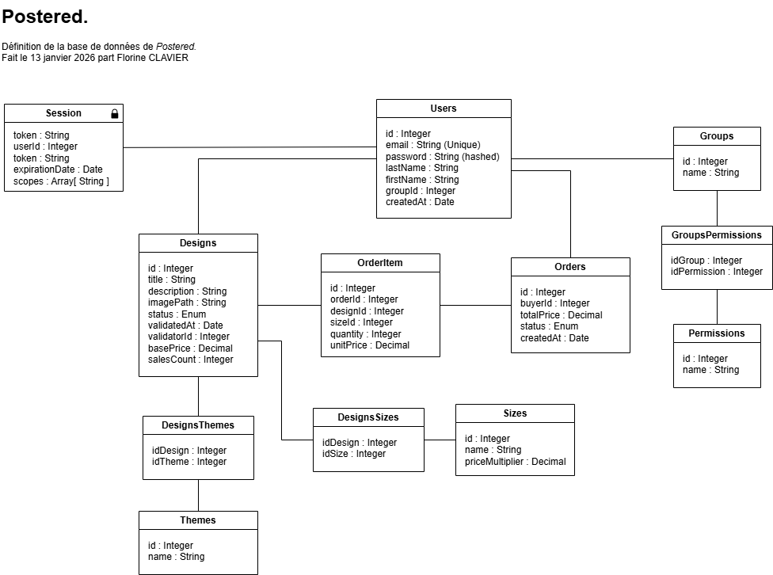

# Postered
_Postered_ est un site web permettant de faire le lien entre des illustrateurs et des acheteurs. Il permet aux illustrateurs de publier leurs illustrations, qui sont ensuite vendues sous forme de posters aux acheteurs du site. Le site a bien sûr un système de modération, demandant à ce que chaque illustration soit vérifiée par un humain avant d'être publiée sur le site. 

## Installation
Le projet est entièrement conteneurisé avec Docker pour garantir un environnement stable et prêt à l'emploi.

### 1. Configuration de l'environnement
Avant de lancer l'infrastructure, vous devez créer votre fichier de configuration local. À la racine du projet, dupliquez le fichier .env.example (qui se trouve dans le backend) et renommez-le en .env :

```bash
cp backend/.env.example backend/.env
```

### 2. Démarrer l'infrastructure
À la racine du projet, exécutez la commande suivante pour construire les images et lancer les services (Base de données, Backend et Frontend) :

```bash
docker-compose up -d --build
```

### 3. Initialiser les données
Une fois les services opérationnels, exécutez le script de peuplement pour générer automatiquement les thèmes, le système de permissions et la galerie de posters :

```bash
docker-compose exec backend npm run seed
```

### Accès au projet
Une fois ces étapes terminées, rendez-vous sur : http://localhost:3000

Bonne balade artistique sur Postered ! ✨

## Identifiants de test

| Rôle | Email | Mot de passe |
| --- | --- | --- |
| Admin | admin@postered.com | admin123 |
| Utilisateur normal | buyer@postered.com | buyer123 |
| Créateur de poster | creator@postered.com | creator123 |
| Modérateur | manager@postered.com | manager123 |

## Permissions & Groupes
### Permissions

| User | Self | Group | Design | Order | Session |
| --- | --- | --- | --- | --- | --- |
| user : read <br> user : write <br> user : delete | self : read <br> self : write | group : read <br> group : write <br> group : delete <br> group : request | design : read <br> design : create <br> design : update <br> design : publish <br> design : delete | order : create <br> order : read <br> order : update | session : read <br> session : write <br> session : delete |

### Groupes 

| Titre | Description | Permissions |
| --- | --- | --- |
| Admin | Peut tout faire | * : * |
| Guest | N’a pas de droit | design : read, self : create |
| UserBuyer | Peut acheter un design | self:*, order:create, order:read |
| UserCreator | Peut ajouter un design et acheter un design | self:*, order:create, order:read, design:create, design:update (own) |
| DesignManager | Peut supprimer et modifier des designs existants | design:update (tous), design:delete (tous), design:publish |

## Base de données

Une base de données PostgreSQL est utilisée pour gérer les données du site.




## Sécurité

### Utilisation de Helmet et CORS

J'ai installé Helmet pour protéger l'application en cachant les infos sensibles du serveur (comme le fait qu'on utilise Express) et en ajoutant des en-têtes de sécurité. Pour le CORS, j'ai configuré le serveur pour qu'il n'accepte que les requêtes venant de mon frontend (`localhost:5173`), ce qui bloque les tentatives de connexion pirate depuis d'autres sites.

### Utilisation de Rate Limit

Pour éviter les attaques de type _brut-force_, j'ai mis en place Rate Limit. Il y a une limite globale pour tout le site, et une limite beaucoup plus stricte sur la page de connexion. 


### Autres

Tous les mots de passe sont hachés par Bcrypt avant d'être enregistrés en base de données. 

J'ai fait attention à valider tout ce qu'envoie l'utilisateur pour éviter les injections XML et SQL. Les injections SQL sont déjà bien sécurisées par l'utilisation de Sequelize. 

J'ai aussi utiliser `npm audit` pour surveiller et corriger les vulnérabilités dans les bibliothèques utilisées. 


## Améliorations futures

Il resterait quelques points à mettre en place pour respecter l'idée de départ et utiliser toutes les permissions inscrites par groupes. 

Par exemple, un créateur de poster peut modifier un de ces designs (le titre, la description, le prix...). Ou un administrateur devrait pouvoir supprimer des utilisateurs. 


## Utilisation de l'IA

L'intelligence artificielle a été utilisée dans ce projet pour la génération du script `seed.js`, et aidé à la création du frontend et à la correction d'erreur. 
